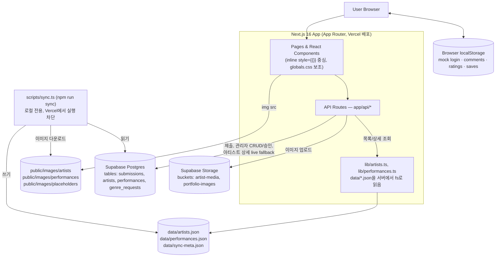

# POPOK 🍰

> 무용을 발견하는 가장 쉬운 방법

# Developer Product Overview

POPOK는 공연을 고르고, 감상을 나누고, 아티스트와 단체를 발견하는 무용 커뮤니티·아카이브 플랫폼입니다. 흩어져 있는 무용 공연, 아티스트, 작품 정보를 하나의 서비스 안에서 연결하여, 사용자가 다음과 같은 흐름으로 자연스럽게 이동하도록 설계되어 있습니다.

공연 발견 → 공연 상세 정보 확인 → 평점 및 감상 공유 → 관련 아티스트 탐색 → 아티스트 대표작 확인

이 문서는 실제 코드베이스(`app/`, `app/api/`, `components/`, `lib/`, `types/`, `scripts/`, `public/`, 설정 파일 전반)를 직접 조사한 결과를 기준으로 작성되었습니다. 처음 이 프로젝트를 인수받는 개발자, 새로운 협업자, 기술 파트너가 이 문서 하나만으로 제품과 코드의 현재 상태를 이해할 수 있도록 하는 것을 목표로 합니다. 이 문서는 개발 로그가 아니며, 기존 `README.md`를 대체하지 않습니다.

---

## 1. Product Overview

**해결하려는 문제**: 한국 무용계는 공연 정보, 아티스트 이력, 작품 기록이 개별 SNS 계정, 개인 포트폴리오, 흩어진 홍보 자료 속에 파편화되어 있습니다. 관객은 어떤 공연을 볼지, 어떤 아티스트를 팔로우할지 판단할 자료를 찾기 어렵고, 아티스트는 자신의 대표작을 한곳에 정리해 보여줄 창구가 마땅치 않습니다.

**주요 사용자**: (1) 공연을 발견하고 감상을 기록하고 싶은 일반 관객, (2) 자신의 대표작과 이력을 등록해 발견되고 싶은 안무가·무용단·프로젝트팀.

**핵심 가치**: 공연 · 작품 · 아티스트 · 단체 · 관객 경험을 하나의 데이터 흐름으로 연결하는 것. 단순 공연 캘린더가 아니라, 공연에서 출발해 아티스트의 대표작 포트폴리오까지 이어지는 발견 경로를 제공합니다.

**차별점**: 아티스트가 직접 대표작(작품명·설명·포스터 이미지·영상 링크)을 등록하는 "Representative Works Portfolio" 구조, 그리고 신청 → 관리자 승인 → 공개 반영으로 이어지는 등록 파이프라인.

**현재 제품 단계**: 초기 MVP 단계입니다. 공연/아티스트 발견 기능은 실동작하며, 등록·승인 파이프라인의 핵심 경로도 동작합니다. 다만 사용자 인증, 댓글·평점·저장 기능은 모두 브라우저 로컬 스토리지 기반의 임시 구현이며(§11, §14 참조), 모바일 반응형은 일부 페이지에 한해 진행 중입니다(§15 참조).

---

## 2. Core User Flow

### Discovery Flow

```
공연 탐색 (/performances)
  → 공연 상세 (/performances/[id])
    → 평점 / 댓글 / 저장            [TEMPORARY — localStorage 기반]
    → 관련 아티스트 링크
  → 아티스트 탐색 (/artists)
    → 아티스트 상세 (/artists/[id])
      → 대표작 포트폴리오 확인       [PARTIAL — §10 참조]
      → 댓글 / 저장                 [TEMPORARY]
```

공연 목록·상세, 아티스트 목록·상세 자체의 데이터 조회는 **IMPLEMENTED** 상태로 실제 동작합니다. 이 흐름 위에 얹힌 평점/댓글/저장은 실제 서버 저장소가 아닌 브라우저 로컬 스토리지에 의존하므로 **TEMPORARY**로 표시했습니다.

### Submission Flow

```
정보 입력 (/submit 기본 정보 폼)
  → 대표작 등록 (여러 개, 작품명/연도/역할/설명)
    → 이미지 업로드 (/api/upload → Supabase Storage)
    → 영상 링크 등록 (YouTube/Vimeo URL 텍스트 입력)
  → 제출 (/api/submit → Supabase `submissions` 테이블, status: pending)
  → 검토 / 승인 (/admin/submissions, 패스코드 보호 수동 검토)
  → 실제 사이트 노출
```

`정보 입력 → 이미지 업로드 → 제출 → Supabase 저장`까지는 **IMPLEMENTED**입니다. `검토/승인`은 관리자가 직접 화면에서 승인 버튼을 누르는 **완전 수동** 절차입니다. 마지막 "실제 사이트 노출" 단계는 **PARTIAL**입니다 — 승인 즉시 Supabase `artists` 테이블에는 반영되지만, 공개 아티스트 목록(`/artists`)과 공연 목록은 Supabase가 아니라 로컬 JSON 캐시(`data/artists.json`, `data/performances.json`)를 읽으므로, 그 목록에 실제로 나타나려면 로컬 환경에서 `npm run sync`를 실행하고 재배포해야 합니다. 자세한 내용은 §9, §12를 참고하세요.

---

## 3. Current Feature Status

| Feature | Status | Description |
|---|---|---|
| Performance Discovery (목록/상세) | IMPLEMENTED | `data/performances.json`을 서버에서 읽어 제공. 정렬/날짜 처리 포함 |
| Artist Database (검색/필터/상세) | IMPLEMENTED | `data/artists.json` 기반 검색, 분야/유형 필터, 페이지네이션 |
| Performance Comments | TEMPORARY | localStorage(`poc_comments`)에 저장, 서버 미저장 |
| Artist Comments | TEMPORARY | localStorage(`poc_artist_comments`)에 저장, 서버 미저장 |
| Ratings (평점) | TEMPORARY | localStorage(`poc_ratings`)에 저장. 평균값도 "이 브라우저에 저장된 평점"만 집계됨 |
| Saved Performances | TEMPORARY | localStorage 사용자 프로필 객체 안의 배열로 저장 |
| Saved Artists | TEMPORARY | 위와 동일한 구조 |
| Representative Works Portfolio | PARTIAL | 입력·저장·승인 경로는 동작하나, 공개 목록 노출은 로컬 sync에 의존 (§10) |
| Image Upload | IMPLEMENTED | Supabase Storage(`portfolio-images`, `artist-media` 버킷)에 업로드 후 public URL 반환 |
| Submission Flow | IMPLEMENTED | `/api/submit` → Supabase `submissions` 테이블 insert, 유효성 검증 포함 |
| Approval Flow | PARTIAL | 관리자 수동 승인은 동작하나, 공개 목록 반영은 수동 동기화+재배포가 필요 |
| Authentication | TEMPORARY | Supabase Auth 미사용. localStorage mock login만 존재 |
| Admin Panel | PARTIAL / TEMPORARY | 신청 검토·승인·아티스트 관리 UI는 동작하나, 인증은 단일 공유 패스코드(기본값 `1234`) |
| Data Sync Script (`npm run sync`) | IMPLEMENTED (수동, 로컬 전용) | Supabase → 로컬 JSON + 이미지 캐시. Vercel 프로덕션에서는 실행 차단됨 |
| Instagram Preview Scraping | PARTIAL | OG 태그 스크레이핑 방식이라 Instagram 정책 변경 시 자주 실패 |
| Mobile Responsive | IN PROGRESS | Header/Home/Performance Detail/Submit 일부 완료, 나머지 진행 중 (§15) |
| Legacy Airtable Integration (`lib/airtable.ts`) | NOT USED | 코드는 남아있으나 어떤 라우트에서도 import되지 않음 (레거시) |

---

## 4. System Architecture



계층별 설명:

- **Client / UI**: React 19 클라이언트 컴포넌트가 대부분(`"use client"`). 스타일은 인라인 `style={{}}` 객체가 중심이며 `globals.css`가 토큰·공용 클래스·모바일 미디어쿼리를 보조합니다.
- **Routing**: Next.js App Router 파일 기반 라우팅(`app/**/page.tsx`). 별도 `middleware.ts`는 존재하지 않습니다.
- **Server / API**: `app/api/**/route.ts`의 Route Handler들. 대부분 `export const dynamic = "force-dynamic"`으로 캐시 없이 매 요청마다 실행됩니다.
- **Data Access**: 두 갈래로 나뉩니다 — (1) `lib/artists.ts`/`lib/performances.ts`가 `data/*.json`을 직접 import/읽어 공개 목록·상세를 서빙, (2) `lib/supabaseServer.ts`/`lib/supabaseSubmissions.ts`가 Supabase 서비스 롤 키로 Supabase를 직접 호출(제출, 관리자, 업로드, 아티스트 단건 상세 조회).
- **Database**: Supabase Postgres. 실제 코드에서 확인되는 테이블은 `submissions`, `artists`, `performances`, `genre_requests` 입니다.
- **File Storage**: Supabase Storage(버킷 `artist-media`, `portfolio-images`)와, 로컬 정적 파일(`public/images/artists`, `public/images/performances`, `public/images/placeholders`) 두 가지가 함께 쓰입니다.
- **Deployment**: Vercel. `.vercel/project.json`으로 프로젝트가 연결되어 있으며(Git-ignore 대상), 별도 GitHub Actions 등 CI 설정 파일은 존재하지 않습니다.

---

## 5. Tech Stack

| Category | Technology | Role |
|---|---|---|
| Framework | Next.js 16.2.9 (App Router, Turbopack) | 페이지 라우팅, React 서버/클라이언트 컴포넌트, API 라우트 실행 |
| Programming Language | TypeScript ^5 | 전체 애플리케이션 코드(`app/`, `lib/`, `components/`, `types/`) 및 대부분의 `scripts/` |
| Runtime | Node.js (Vercel Serverless Functions) | API 라우트 및 서버 컴포넌트 실행 환경 |
| UI Library | React 19.2.4 / React DOM 19.2.4 | 컴포넌트 렌더링 |
| Styling | 인라인 `style={{}}` 객체 + `app/globals.css` | 대부분의 레이아웃·색상·간격은 컴포넌트 안 인라인 스타일로 직접 정의. `globals.css`는 CSS 커스텀 프로퍼티(디자인 토큰), `.card`/`.tag`/`.display`/`.mono` 등 공용 클래스, 폼 요소 기본 스타일, 모달 스타일, 그리고 `@media (max-width: 768px)` 모바일/태블릿 반응형 오버라이드(`!important`로 인라인 스타일을 재정의)를 담당 |
| CSS Framework | Tailwind CSS ^4 (`@tailwindcss/postcss`) | `globals.css`에서 `@import "tailwindcss"`로 불러오지만, 실제 컴포넌트에서는 Tailwind 유틸리티 클래스보다 인라인 스타일 사용이 압도적으로 많음 |
| Database | Supabase (Postgres) | `submissions`, `artists`, `performances`, `genre_requests` 테이블 저장/조회 |
| File Storage | Supabase Storage | 아티스트/작품 이미지 업로드 및 public URL 서빙 |
| Legacy Data Source | Airtable SDK (`airtable` ^0.12.2) | 과거 데이터 소스. `lib/airtable.ts`에 코드가 남아 있지만 현재 어떤 라우트에서도 사용되지 않음(§9) |
| Authentication | 없음 (localStorage mock) | Supabase Auth, NextAuth 등 실제 인증 라이브러리는 사용되지 않음. `@supabase/ssr`는 의존성에는 있으나 실제 인증 플로우에 배선되어 있지 않음 |
| Deployment | Vercel | `.vercel/project.json`으로 프로젝트 연결 |
| Package Manager | npm (`package-lock.json` 존재) | |
| Version Control | Git | |

**참고**: `package.json`에 없는 라이브러리(예: 상태관리 라이브러리, UI 컴포넌트 킷, 폼 라이브러리)는 이 프로젝트에 존재하지 않습니다. `next/image`도 사용되지 않으며 — `next.config.ts`에 이미지 도메인 설정이 없고, 모든 이미지는 일반 `` 태그 또는 CSS `background` 속성으로 렌더링됩니다.

---

## 6. Project Structure

```
poc-app/
├── app/
│   ├── api/                 # 서버 API 라우트 (Route Handlers)
│   ├── admin/                # 관리자 대시보드/승인/동기화 페이지 (패스코드 보호)
│   ├── artists/               # 아티스트 목록(/artists) 및 상세(/artists/[id])
│   ├── performances/          # 공연 목록(/performances) 및 상세(/performances/[id])
│   ├── login/                 # mock 로그인 페이지
│   ├── profile/                # 내 저장/댓글/평점 마이페이지
│   ├── recommend/              # 취향 설문 기반 추천 페이지
│   ├── submit/                 # 아티스트 등록 신청 폼
│   ├── layout.tsx              # 루트 레이아웃 (Header/Footer 포함)
│   ├── page.tsx                 # 홈(`/`)
│   ├── globals.css              # 디자인 토큰, 공용 클래스, 반응형 미디어쿼리
│   └── not-found.tsx            # 404 페이지
├── components/                  # 재사용 UI 컴포넌트 (카드, 모달, 헤더/푸터, 상태 UI 등)
│   └── ui/States.tsx             # LoadingSpinner / ErrorMessage / EmptyState
├── lib/                          # 데이터 접근 및 유틸리티
├── types/
│   └── index.ts                  # 프로젝트 전역에서 실제로 쓰이는 타입 정의
├── data/                         # 공개 목록/상세가 실제로 읽는 로컬 JSON 캐시
│   ├── artists.json
│   ├── performances.json
│   └── sync-meta.json
├── scripts/                      # 로컬 전용 유지보수/동기화 스크립트
├── public/
│   ├── logo.png                   # 공식 로고 (원본 이미지 파일, 재생성 금지)
│   └── images/
│       ├── artists/                 # 동기화 스크립트가 다운로드한 아티스트 이미지
│       ├── performances/            # 동기화 스크립트가 다운로드한 공연 포스터
│       └── placeholders/            # 기본 대체 이미지(cake-placeholder.png)
├── next.config.ts
├── tsconfig.json
└── package.json
```

### 핵심 디렉토리 역할

- **`app/`**: 페이지 라우트(App Router)와 API 라우트가 모두 이 아래에 있습니다. 파일 시스템 경로가 곧 URL 경로입니다.
- **`app/api/`**: 서버 전용 로직. Supabase 서비스 롤 키, 로컬 JSON 파일 읽기/쓰기가 여기서만 이루어집니다(클라이언트에 비밀키 노출 없음).
- **`components/`**: `ArtistCard`, `PerformanceCard`, `ArtistModal`, `AuthNav`, `Header`, `Footer`, `Logo3D`, `CountUp`, `components/ui/States.tsx` 등 페이지 간 공유되는 UI 블록.
- **`lib/`**: Supabase 클라이언트 초기화(`supabaseServer.ts`), Supabase 기반 신청서 CRUD(`supabaseSubmissions.ts`), 로컬 JSON 기반 조회 유틸(`artists.ts`, `performances.ts`), 브라우저 localStorage 기반 mock 인증/댓글/평점/저장(`supabase.ts` — 이름과 달리 Supabase를 호출하지 않음), Supabase→JSON 동기화 로직(`syncArtists.ts`, `syncPerformances.ts`), 레거시 Airtable 클라이언트(`airtable.ts`, 미사용).
- **`types/`**: `types/index.ts`가 실제 서비스 전역에서 쓰이는 `Artist`, `Performance`, `UserProfile`, `PerformanceComment`, `ArtistComment` 등의 타입을 정의합니다. (`lib/types.ts`라는 더 오래된 타입 정의 파일도 남아있지만 현재 라우트/컴포넌트에서 사용되지 않는 레거시입니다.)
- **`scripts/`**: 로컬 개발 환경에서만 실행하는 데이터 동기화·점검·마이그레이션 스크립트 모음(§19).
- **`public/`**: 정적 파일. 공식 로고(`logo.png`)와 동기화 스크립트가 캐시한 아티스트/공연 이미지가 위치합니다.

---

## 7. Pages & Routes

| Route | Page (파일) | Purpose | Status |
|---|---|---|---|
| `/` | `app/page.tsx` | 홈 — 히어로, 최근 공연, 추천 아티스트, DB 통계, About 배너 | IMPLEMENTED |
| `/performances` | `app/performances/page.tsx` | 전체 공연 목록 | IMPLEMENTED |
| `/performances/[id]` | `app/performances/[id]/page.tsx` | 공연 상세, 평점/댓글/저장, 관련 아티스트 | IMPLEMENTED (평점/댓글/저장은 TEMPORARY) |
| `/artists` | `app/artists/page.tsx` + `ArtistsClient.tsx` | 아티스트 검색·필터·페이지네이션 목록 | IMPLEMENTED |
| `/artists/[id]` | `app/artists/[id]/page.tsx` | 아티스트 상세, 대표작 포트폴리오, 댓글, 저장, 공유 | IMPLEMENTED (댓글/저장은 TEMPORARY, 포트폴리오 노출은 PARTIAL) |
| `/submit` | `app/submit/page.tsx` | 아티스트 등록 신청 폼 + 대표작 입력 + 이미지 업로드 | IMPLEMENTED |
| `/login` | `app/login/page.tsx` | mock 로그인(이메일+닉네임, localStorage 세션) | TEMPORARY |
| `/profile` | `app/profile/page.tsx` | 내 저장 목록/댓글/평점 마이페이지 | TEMPORARY (mock 세션 의존) |
| `/recommend` | `app/recommend/page.tsx` | 취향 설문 기반 추천 페이지 | PARTIAL (클라이언트 전용, 로컬 JSON 기반) |
| `/admin` | `app/admin/page.tsx` | 관리자 패스코드 로그인 + 대시보드 통계 | PARTIAL / TEMPORARY (단일 공유 패스코드 인증) |
| `/admin/submissions` | `app/admin/submissions/page.tsx` | 신청 목록 조회, 승인/반려/수정 | IMPLEMENTED (수동 승인) |
| `/admin/artists` | `app/admin/artists/page.tsx` | 승인된 아티스트 목록 관리(삭제, 인증 코드 발급) | IMPLEMENTED |
| `/admin/performances` | `app/admin/performances/page.tsx` | 공연 목록 확인 + Supabase→JSON 동기화 트리거 | PARTIAL (개별 공연 수정 UI는 없음) |
| `/admin/sync` | `app/admin/sync/page.tsx` | Supabase→로컬 JSON 동기화 트리거 및 마지막 동기화 정보 표시 | IMPLEMENTED (로컬 전용) |
| (미매칭 전체 경로) | `app/not-found.tsx` | 404 페이지 | IMPLEMENTED |

---

## 8. API Routes

인증(Auth) 열의 "Admin Passcode"는 요청 헤더 `x-admin-passcode` 값이 환경변수 `ADMIN_PASSCODE`(미설정 시 기본값 `1234`)와 일치해야 함을 의미합니다.

| Endpoint | Method | Purpose | Data Source | Auth |
|---|---|---|---|---|
| `/api/artists` | GET | 아티스트 검색/필터 목록 | 로컬 JSON (`lib/artists.ts`) | 없음 |
| `/api/artists/[id]` | GET | 아티스트 단건 상세 | Supabase `artists` 실시간 조회 우선, 실패 시 로컬 JSON fallback | 없음 |
| `/api/performances` | GET | 전체 공연 목록 | 로컬 JSON (`lib/performances.ts`) | 없음 |
| `/api/performances/[id]` | GET | 공연 단건 상세 | 로컬 JSON | 없음 |
| `/api/works` | GET | 아티스트 작품 목록(파생 데이터) | 로컬 JSON의 `artists[].works`에서 즉석 매핑 | 없음 |
| `/api/submit` | POST | 아티스트 등록 신청 저장 | Supabase `submissions` (insert, status: pending) | 없음 |
| `/api/upload` | POST | 이미지 파일 업로드 | Supabase Storage (기본 버킷 `artist-media`, 폼 필드로 지정 가능) | 없음 |
| `/api/survey` | POST | 타 장르 지원 요청 설문 저장 | Supabase `genre_requests` (insert) | 없음 |
| `/api/instagram/preview` | POST | Instagram 프로필 OG 태그 스크레이핑 | 외부 Instagram 페이지 HTML 파싱 (DB 미사용) | 없음 |
| `/api/admin/submissions` | GET | 신청 목록 조회 | Supabase `submissions` | Admin Passcode |
| `/api/admin/submissions/[id]` | POST | 승인(approve)/반려(reject)/수정(update) | Supabase `submissions`, 승인 시 `artists`에 신규 insert | Admin Passcode |
| `/api/admin/artists` | GET | 승인된 아티스트 목록 조회 | Supabase `artists` | Admin Passcode |
| `/api/admin/artists/[id]` | DELETE | 아티스트 삭제(연결된 공연은 `artist_id`만 해제) | Supabase `artists`, `performances` | Admin Passcode |
| `/api/admin/artists/[id]` | POST | 아티스트 클레임 코드(`poc_xxxxxxxx`) 발급 | Supabase `artists` | Admin Passcode |
| `/api/admin/stats` | GET | 대시보드 통계(신청 현황, 게시 수, 마지막 동기화 시각) | Supabase `submissions` + 로컬 JSON + `sync-meta.json` | Admin Passcode |
| `/api/admin/sync` | POST | Supabase → 로컬 JSON 캐시 + 이미지 동기화 실행 | Supabase → `data/*.json`, `public/images/*` | Admin Passcode, **Vercel 프로덕션에서는 강제 차단** |
| `/api/admin/verify` | POST | 관리자 패스코드 검증(로그인 게이트) | 환경변수 비교만 수행, DB 미사용 | 없음(검증 대상 자체) |
| `/api/debug/airtable` | GET | Airtable 자격증명/테이블 연결 진단(레거시 디버그용) | Airtable API 직접 호출 | 없음 |

---

## 9. Data Architecture

**두 갈래의 데이터 원천이 공존합니다.** 이는 이 프로젝트를 이해하는 데 가장 중요한 구조적 특징입니다.

1. **Supabase Postgres (실제 쓰기 대상, 관리자·제출 경로의 진실 원천)**
   - `submissions` 테이블: `/submit` 폼 제출 데이터. `status` 필드로 `pending` → `approved`/`rejected` 상태 관리. `portfolio_works` 컬럼에 대표작 배열을 JSONB로 저장(`lib/supabaseSubmissions.ts`).
   - `artists` 테이블: 관리자가 승인한 정식 아티스트 레코드. `slug`, `claim_code`, `profile_image`, `portfolio_works`, `owner_user_id` 등의 컬럼이 코드에서 확인됩니다.
   - `performances` 테이블: 공연 레코드(`slug`, `external_id`, `image_url`, `artist_id` 등). 관리자 UI에서 직접 생성하는 흐름은 코드상 확인되지 않고, 동기화 스크립트가 읽기만 수행합니다.
   - `genre_requests` 테이블: `/submit` 페이지의 "타 장르도 원해요" 설문 제출 저장.

2. **로컬 JSON 캐시 (공개 목록/상세 페이지의 실제 조회 대상)**
   - `data/artists.json`, `data/performances.json`: `lib/artists.ts`/`lib/performances.ts`가 Node.js 서버 사이드에서 직접 `import`하여 읽습니다. `/api/artists`, `/api/performances`, `/api/performances/[id]`, `/api/works`가 전부 이 파일들을 조회합니다.
   - `data/sync-meta.json`: 마지막 동기화 시각과 레코드 수를 담는 메타데이터.
   - 이 JSON 파일들은 **Supabase에서 자동으로 실시간 반영되지 않습니다.** `lib/syncArtists.ts` / `lib/syncPerformances.ts`(함수명은 `...FromAirtable`이지만 실제로는 Supabase에서 읽습니다)가 Supabase 테이블 내용을 읽어 이 JSON 파일들을 덮어쓰는 방식이며, 이 동기화는 로컬 개발 환경에서 수동으로 실행(`npm run sync` 또는 `/admin/sync` 화면)하고 다시 배포해야 공개 목록에 반영됩니다. `process.env.VERCEL === "1"`인 경우 이 동기화 자체가 코드 레벨에서 차단됩니다(§12).

**예외**: `/api/artists/[id]`(아티스트 단건 상세)만 Supabase를 **실시간으로 직접 조회**하고, 실패하거나 없을 때만 로컬 JSON으로 폴백합니다. 따라서 방금 승인된 아티스트라도 `slug`나 `name`으로 상세 페이지 URL에 직접 접근하면 Supabase 데이터가 즉시 보일 수 있지만, `/artists` 목록/검색에는 로컬 동기화 전까지 나타나지 않습니다.

**이미지 저장**: 업로드 시점(`/api/upload`)에는 Supabase Storage에 저장되고 public URL이 반환됩니다. 이후 동기화 스크립트가 그 URL의 이미지를 다운로드하여 `public/images/artists/{id}.{ext}` 또는 `public/images/performances/{id}.{ext}`로 로컬에 캐시하며, 로컬 JSON의 `profileImage`/`posterImage` 필드는 이 로컬 경로를 가리키게 됩니다.

**공개 페이지의 데이터 읽기 방식 요약**: 목록/검색 페이지 → 항상 로컬 JSON. 아티스트 상세 페이지 → Supabase 우선, 로컬 JSON 폴백. 공연 상세 페이지 → 항상 로컬 JSON.

---

## 10. Representative Works Portfolio

**목적**: 아티스트가 자신의 대표작(작품명, 설명, 포스터 이미지, 영상 링크)을 여러 건 등록해 자신의 작업 세계를 소개하는 핵심 기능입니다.

**입력 페이지**: `/submit` (`app/submit/page.tsx`). `works` 상태(`PortfolioWork[]`)에 "+ 대표작 추가하기" 버튼으로 항목을 추가/삭제하며, **여러 개 등록이 가능**합니다.

**입력 가능한 데이터** (타입 `PortfolioWork`, `app/submit/page.tsx`):
- `title` (작품명, 필수)
- `year` (제작 연도)
- `role` (본인의 역할)
- `description` (작품 소개)
- `image_url` (대표 이미지 — 파일 선택 시 `handleFileUpload`가 `/api/upload`를 호출해 Supabase Storage `portfolio-images` 버킷에 업로드하고 반환된 public URL을 저장)
- `video_url` (YouTube/Vimeo 등 영상 링크 — 파일 업로드가 아니라 URL 텍스트 입력)

**표시 페이지**:
- `/artists/[id]` 상세 페이지: "대표작 포트폴리오" 그리드로 표시되며, 카드를 클릭하면 모달이 열려 이미지·설명·영상을 보여줍니다. `parseVideoUrl()` 함수가 YouTube/Vimeo URL을 감지해 반응형 임베드 플레이어로 렌더링하고, 그 외 링크는 "영상 보러가기" 외부 링크 버튼으로 표시됩니다.
- `components/ArtistModal.tsx` (오버레이 형태로도 동일 데이터 표시).
- 이미지가 없는 작품은 아티스트 프로필 사진 또는 `public/images/placeholders/cake-placeholder.png`로 대체됩니다.

**제출 데이터 저장 방식**: 폼 제출 시 `portfolio_works` 배열 전체가 `/api/submit` → Supabase `submissions.portfolio_works`(JSONB)에 저장됩니다. 관리자가 승인하면 `createArtistFromSubmission()`이 동일한 `portfolio_works` 배열을 Supabase `artists.portfolio_works`로 그대로 복사합니다.

**승인 후 사이트 노출 방식**: `/api/artists/[id]`가 Supabase를 실시간 조회하므로, 승인된 아티스트의 상세 페이지는 슬러그를 알면 즉시 포트폴리오를 보여줄 수 있습니다. 그러나 `/artists` 목록/검색을 통한 **발견**은 로컬 JSON 동기화 이후에만 가능합니다.

**상태**: **PARTIAL**로 표시합니다. 입력·업로드·제출·승인·단건 상세 노출까지는 동작하지만, 목록을 통한 공개 발견 경로가 수동 동기화에 의존하는 구조적 한계가 있고, 이미지/영상이 없는 경우의 UX(플레이스홀더 처리 등)도 최소 수준으로만 구현되어 있습니다.

---

## 11. Authentication & User State

> **TEMPORARY IMPLEMENTATION** — 아래는 운영 가능한 인증 시스템이 아니라 데모/프로토타입 수준의 브라우저 로컬 세션입니다.

- **Supabase Auth는 현재 사용되지 않습니다.** `lib/supabase.ts` 하단에 `NEXT_PUBLIC_SUPABASE_URL`/`NEXT_PUBLIC_SUPABASE_ANON_KEY`를 사용하는 코드가 있지만, 전체가 주석 처리되어 있으며 "Supabase Integration Placeholders (Future Setup)"이라는 설명만 남아 있는 미래 계획용 코드입니다. 실제로 이 환경변수를 읽는 활성 코드는 없습니다.
- **실제 로그인**은 `lib/supabase.ts`의 `mockLogin(email, nickname)`이 전부입니다. 이메일 형식 유효성만 클라이언트에서 검사하고, 비밀번호 확인이나 서버 인증 없이 `UserProfile` 객체를 생성해 `localStorage`(`poc_user_profile` 키)에 저장합니다.
- **사용자 ID**는 `mock-user-${Date.now()}` 형태로 클라이언트에서 즉석 생성되며, 서버의 실제 계정 테이블과 연결되어 있지 않습니다.
- **로그인 상태 확인**은 어디서든 `getLoggedInUser()`가 `localStorage`를 읽어 판단합니다(`components/AuthNav.tsx`, 각 상세 페이지 등). 로그인/로그아웃 시 `window.dispatchEvent(new Event("poc-auth-change"))`로 같은 탭 내 다른 컴포넌트에 상태 변경을 알립니다.
- 댓글, 평점, 공연 저장, 아티스트 저장 기능은 **모두 동일하게** `getLoggedInUser()`가 반환하는 이 로컬 mock 사용자 객체에 의존합니다. 로그인하지 않은 상태에서는 각 기능이 `/login?redirect=...`로 리다이렉트를 유도합니다.
- 관리자(`/admin/*`) 인증은 별도 체계로, 사용자 로그인과 무관하게 **단일 공유 패스코드**(`ADMIN_PASSCODE` 환경변수, 미설정 시 `"1234"`)를 `sessionStorage`와 API 요청 헤더에서 비교하는 방식입니다.

---

## 12. Submission & Approval Pipeline

```
Submit Form (/submit)
  ↓  (fetch POST)
Image Upload (/api/upload → Supabase Storage)
  ↓
Database Submission (/api/submit → Supabase `submissions`, status: pending)
  ↓
Review / Approval (/admin/submissions, 수동)
  ↓
Public Website (조건부, 아래 참고)
```

- **Submit Form**: `app/submit/page.tsx`. 기본 정보 + 대표작 여러 건 + 연락처를 입력받는 단일 폼 컴포넌트.
- **Image Upload**: 대표작 이미지 선택 시 즉시 `/api/upload`로 업로드되고, 반환된 URL이 폼 상태의 `work.image_url`에 저장됩니다(폼 제출 전에 이미 업로드가 끝나 있음).
- **Database Submission**: 폼 제출 시 `/api/submit`이 이름·이메일 유효성만 서버에서 재검증한 뒤 `lib/supabaseSubmissions.ts`의 `createSubmission()`으로 Supabase `submissions` 테이블에 `status: "pending"`으로 insert합니다.
- **Review / Approval**: `/admin/submissions` 페이지(`app/admin/submissions/page.tsx`)에서 관리자가 신청 목록을 확인하고, 승인/반려/수정 모달을 통해 `/api/admin/submissions/[id]`(POST, `action: "approve"|"reject"|"update"`)를 호출합니다. **실제로 존재하는 관리자 UI**이며, 완전 수동 검토 방식입니다(자동 승인 로직 없음).
  - 승인(`approve`) 시: `createArtistFromSubmission()`이 Supabase `artists` 테이블에 신규 레코드를 insert하고, 해당 submission의 `status`를 `"approved"`로 갱신합니다.
- **Public Website 반영**: 승인된 아티스트는 Supabase `artists`에는 즉시 존재합니다. `/api/artists/[id]` 단건 상세는 Supabase를 직접 조회하므로 슬러그를 알면 바로 노출될 수 있습니다. 그러나 `/artists` 목록·검색은 로컬 JSON(`data/artists.json`)만 읽으므로, 관리자가 로컬 환경에서 `npm run sync`(또는 `/admin/sync`)를 실행해 JSON을 갱신하고 다시 배포하기 전까지는 목록에 나타나지 않습니다. **이 단계는 PARTIAL입니다.**

---

## 13. Image Upload System

- **업로드 UI**: `/submit` 페이지의 대표작 항목 안 `<input type="file" accept="image/*">` — 파일 선택 즉시 업로드가 시작됩니다(별도 "업로드" 버튼 없음). 업로드 중에는 "업로드 중..." 텍스트와 48×48 썸네일 미리보기가 표시됩니다.
- **API Route**: `POST /api/upload` (`app/api/upload/route.ts`). `FormData`로 `file`, `path`(저장 경로 prefix, 기본값 `"submissions"`), `bucket`(기본값 `"artist-media"`)을 받습니다. `/submit` 페이지는 대표작 이미지 업로드 시 명시적으로 `bucket: "portfolio-images"`를 지정합니다.
- **Supabase Storage 연결**: `getSupabaseServer()`(서비스 롤 키)로 `supabase.storage.from(bucket).upload(filePath, buffer, { upsert: true })` 호출. 파일명은 `${Date.now()}-${random}.${ext}`로 충돌을 방지합니다.
- **확인된 버킷 이름**: `artist-media`(기본값), `portfolio-images`(대표작 이미지 전용). 두 버킷 모두 `scripts/createBucket.ts`, `scripts/testBucketUpload.ts`에서도 참조됩니다.
- **반환 URL**: 업로드 성공 시 `supabase.storage.from(bucket).getPublicUrl(filePath)`로 public URL을 받아 클라이언트에 반환하고, 폼 상태의 `image_url` 필드에 그대로 저장됩니다.
- **DB 데이터와의 연결**: 이 public URL 문자열이 제출 시 `portfolio_works[].image_url`로 `submissions` 테이블에, 승인 후에는 `artists` 테이블에 그대로 복사되어 저장됩니다. 이후 동기화 스크립트가 이 URL의 이미지를 다운로드해 `public/images/*`에 로컬 캐싱합니다(§9).

Service Role Key 등 실제 비밀값은 이 문서에 포함하지 않았습니다.

---

## 14. Comments, Ratings & Saves

모든 기능이 **서버 저장이 아닌 브라우저 `localStorage`** 기반이며, 로그인 상태(§11의 mock 사용자)에 의존합니다. 실제 사용자별 데이터 "분리"는 되어 있지만(각 레코드에 `userId` 저장), 그 저장소 자체가 각 사용자의 개별 브라우저 안에만 존재하므로 다른 기기·다른 브라우저·시크릿 모드에서는 전혀 보이지 않습니다.

| 기능 | 저장 위치 | 로그인 필요 | 사용 페이지 | 사용자별 분리 | 상태 |
|---|---|---|---|---|---|
| 공연 댓글 | `localStorage["poc_comments"]` | 필요 | `/performances/[id]` | O (`userId` 필드로 필터) | TEMPORARY |
| 아티스트 댓글 | `localStorage["poc_artist_comments"]` | 필요 | `/artists/[id]` | O | TEMPORARY |
| 평점 | `localStorage["poc_ratings"]` | 필요 | `/performances/[id]` | O (사용자당 공연별 1개, 재제출 시 덮어씀) | TEMPORARY |
| 공연 저장 | `localStorage["poc_user_profile"].savedPerformances` | 필요 | `/performances/[id]`, `/profile` | O (프로필 객체 내 배열) | TEMPORARY |
| 아티스트 저장 | `localStorage["poc_user_profile"].savedArtists` | 필요 | `/artists/[id]`, `/profile` | O | TEMPORARY |

**중요한 세부사항**: 평점의 "평균 평점"은 해당 공연에 대해 **이 브라우저의 localStorage에 누적된 모든 평점**을 평균낸 값입니다(`getAverageRating()`). 실제로는 여러 사용자가 같은 브라우저를 공유하지 않는 한 사실상 "내가 매긴 평점"만 반영되므로, 사이트 전체를 대표하는 평균이 아닙니다. 좋아요(❤️) 기능도 댓글 객체 안의 `likesUsers` 배열에 `userId`를 추가/제거하는 방식으로 동일한 localStorage 구조 안에서 처리됩니다.

**운영 가능 여부**: 현재 구조는 데모/시연 목적으로는 동작하지만, 실제 다수 사용자가 공유하는 서비스로 운영하기에는 적합하지 않습니다. 서버 저장소(Supabase 테이블 + 실제 인증)로의 이전이 필요합니다.

---

## 15. Responsive Design

작업 원칙(실제 코드에도 이대로 반영됨): 데스크톱 인라인 스타일을 기준값으로 유지하고, 필요한 요소에만 `className` 훅을 추가한 뒤 `app/globals.css`의 `@media (max-width: 768px)` 블록에서 `!important`로 오버라이드합니다. 767px 이하와 768px을 한 번에 묶어 "모바일/태블릿", 768px 초과(1024px 포함)를 "데스크톱 — 기존 그대로"로 취급합니다.

| Page | Desktop (>768px) | Tablet/Mobile (≤768px) |
|---|---|---|
| Header | 기존 그대로 | 햄버거 메뉴로 전환 완료 (nav 링크 숨김 + 드롭다운) |
| Footer | 기존 그대로 | 미작업 (아직 별도 대응 없음) |
| Home | 기존 그대로 | 히어로/About 배너 1단 컬럼, 통계 패딩 축소, 히어로 로고 축소 완료 |
| Performances (목록) | 기존 그대로 | 미작업 (카드 그리드 자체는 `auto-fill`이라 자연스럽게 줄바꿈되지만 별도 검증/조정 없음) |
| Performance Detail | 기존 그대로 | 포스터+정보 2단 → 1단 컬럼 완료 |
| Artists (목록) | 기존 그대로 | 미작업 (검색/필터 바, 페이지네이션 버튼 터치 타겟 등 미조정) |
| Artist Detail | 기존 그대로 | 미작업 |
| Submit | 기존 그대로 | 5곳의 2단 필드 그리드를 `@media (max-width: 640px)`에서 1단으로 전환 완료 |
| Login | 기존 그대로 | 작업 대상에서 제외(원래 구조상 이미 좁은 화면에 적합) |

**상태: IN PROGRESS.** Header 햄버거 메뉴, Home 1단 컬럼, Submit 폼 1단 컬럼, Performance Detail 1단 컬럼까지는 완료되었고, Footer/Performances 목록/Artists 목록/Artist Detail의 터치 타겟·여백 조정은 아직 진행되지 않았습니다.

---

## 16. Environment Variables

아래는 코드에서 실제로 참조하는 환경변수 **이름**만 정리한 것입니다. 값은 포함하지 않았습니다.

```env
SUPABASE_URL=
SUPABASE_SERVICE_ROLE_KEY=
ADMIN_PASSCODE=
AIRTABLE_API_KEY=
AIRTABLE_BASE_ID=
AIRTABLE_ARTISTS_TABLE=
AIRTABLE_WORKS_TABLE=
AIRTABLE_SUBMISSIONS_TABLE=
```

- `SUPABASE_URL` / `SUPABASE_SERVICE_ROLE_KEY`: `lib/supabaseServer.ts`가 서버 사이드에서만 사용하는 Supabase 프로젝트 URL과 서비스 롤 키. 모든 Supabase 테이블/스토리지 접근에 사용됩니다.
- `ADMIN_PASSCODE`: `/admin/*` 및 `/api/admin/*`를 보호하는 단일 공유 패스코드 문자열. 미설정 시 코드 기본값 `"1234"`가 사용됩니다.
- `AIRTABLE_API_KEY` / `AIRTABLE_BASE_ID` / `AIRTABLE_ARTISTS_TABLE` / `AIRTABLE_WORKS_TABLE` / `AIRTABLE_SUBMISSIONS_TABLE`: 레거시 Airtable 자격증명. 현재 `lib/airtable.ts`(미사용) 및 진단용 `/api/debug/airtable`에서만 참조됩니다.

**참고**: Vercel 플랫폼이 자동으로 주입하는 `process.env.VERCEL` 값도 코드에서 확인용으로 사용되지만(§9, §12), 이는 사용자가 직접 설정하는 값이 아닙니다. `NEXT_PUBLIC_SUPABASE_URL`/`NEXT_PUBLIC_SUPABASE_ANON_KEY`는 `lib/supabase.ts`의 주석 처리된 코드 안에만 등장하며, 현재 실행되는 코드 경로에서는 사용되지 않습니다.

---

## 17. Local Development

`package.json`의 `scripts` 기준입니다.

1. **저장소 준비**: 저장소를 clone/pull 합니다.
2. **Dependency install**:
   ```bash
   npm install
   ```
3. **Environment setup**: 프로젝트 루트에 `.env.local`을 생성하고 §16의 환경변수 이름에 맞는 값을 채웁니다.
4. **Development server**:
   ```bash
   npm run dev
   ```
5. **Build**:
   ```bash
   npm run build
   ```
6. **Production start**:
   ```bash
   npm run start
   ```

추가로 데이터 동기화가 필요할 때는 다음을 로컬에서 실행합니다(§19 참고):
```bash
npm run sync
```

---

## 18. Build & Deployment

- **버전 관리**: Git 저장소이며, `.gitignore`에 `.env*`, `.vercel`, `.next/`가 제외되어 있습니다.
- **GitHub**: 원격 저장소로 사용되는 것으로 보이나, 이 문서 작성 기준 코드베이스 안에는 `.github/workflows` 등 CI 파이프라인 설정 파일이 존재하지 않습니다.
- **Vercel**: `.vercel/project.json`(Git에는 커밋되지 않음)으로 프로젝트가 로컬에 연결되어 있습니다. 별도 `vercel.json` 설정 파일은 없으므로, 빌드는 Next.js 기본 설정(`next build`)을 그대로 따릅니다.
- **Build Command**: `next build` (`npm run build`).
- **Environment Variables**: Supabase/Admin 관련 값은 Vercel 프로젝트 설정에도 동일하게 등록되어 있어야 프로덕션에서 API 라우트가 정상 동작합니다(§16).
- **Supabase Connection**: 프로덕션에서도 `SUPABASE_URL`/`SUPABASE_SERVICE_ROLE_KEY`를 통해 동일하게 연결됩니다. 다만 `process.env.VERCEL === "1"`인 프로덕션 환경에서는 `syncArtistsFromAirtable`/`syncPerformancesFromAirtable`(즉 `/api/admin/sync`, `npm run sync`)이 파일시스템 쓰기 제한 때문에 코드 레벨에서 명시적으로 차단됩니다.
- **자동 배포 여부**: 코드베이스만으로는 Git push 시 Vercel이 자동 배포하도록 연동되어 있는지, 수동 `vercel` CLI 배포를 쓰는지 단정할 수 없습니다. Vercel 프로젝트 연결(`project.json`) 존재로 미루어 Vercel의 Git 연동 자동 배포일 가능성이 높지만, 이는 Vercel 대시보드 설정에 달려 있어 코드로는 확인되지 않습니다.

---

## 19. Data Scripts & Maintenance

`scripts/` 폴더 전체를 조사한 결과입니다. `npm run sync`로 등록된 것은 `sync.ts` 하나뿐이며, 나머지는 `npx tsx scripts/<파일명>.ts`로 직접 실행하는 로컬 전용 유지보수 스크립트입니다.

| 파일 | 목적 | 처리 데이터 | 사용 시점 | package.json 등록 |
|---|---|---|---|---|
| `sync.ts` | Supabase → `data/artists.json`/`data/performances.json`/`public/images/*` 동기화 CLI 실행기 | 아티스트, 공연 | 승인된 신규 데이터를 공개 목록에 반영하기 전 | O (`npm run sync`) |
| `migrateSlugsToSupabase.ts` | 기존 아티스트/공연 레코드에 `slug` 컬럼을 채우는 1회성 마이그레이션 (`--write` 플래그 없으면 dry-run) | Supabase `artists`/`performances` | slug 체계 도입/정비 시 | X |
| `createBucket.ts` | Supabase Storage 버킷 생성 확인/설정 | Storage 설정 | 초기 환경 셋업 시 | X |
| `testBucketUpload.ts` | Storage 업로드 동작 점검용 테스트 | Storage | 업로드 기능 디버깅 시 | X |
| `testSubmissions.ts` | `lib/supabaseSubmissions.ts`의 CRUD 함수들을 CLI에서 점검 | Supabase `submissions`/`artists` | 제출·승인 로직 디버깅 시 | X |
| `inspectDb.ts` / `inspectAllDb.ts` / `inspectConstraints.ts` | Supabase 테이블 구조/제약조건/데이터를 조회해 콘솔에 출력 | Supabase 전체 | 스키마 확인, 트러블슈팅 시 | X |
| `inspectStorage.ts` | Supabase Storage 버킷/파일 목록 점검 | Storage | 스토리지 상태 확인 시 | X |
| `queryTest.ts` | Supabase 쿼리 임시 테스트 | Supabase | 개발 중 임시 쿼리 검증 | X |
| `findPerformanceInJson.ts` / `searchJson.ts` | 로컬 `data/performances.json` 안에서 특정 레코드를 찾는 1회성 조회 스크립트 | 로컬 JSON | 데이터 정합성 확인 시 | X |
| `convertJson.js` / `reconvert.js` | `data/artists.json`을 가공/보강하기 위한 1회성 변환 스크립트 | 로컬 JSON | 과거 데이터 마이그레이션 작업용(현재는 참고용) | X |
| `extractArtists.py` | 외부 소스(Obsidian vault 등 로컬 경로 하드코딩)에서 아티스트 데이터를 최초 추출하던 스크립트 | 외부 원본 데이터 | 최초 데이터 시딩 시점에 사용된 것으로 보임 | X |

`sync`, `slug` 마이그레이션, `performance`/`artist` 동기화 관련 스크립트는 모두 **로컬 환경에서만** 실행되도록 설계되어 있으며(`syncArtists.ts`/`syncPerformances.ts` 내부에서 `process.env.VERCEL === "1"`이면 즉시 예외를 던짐), Vercel 프로덕션 서버에서 직접 실행하는 용도가 아닙니다.

---

## 20. Current Development Status

**Completed**
- 공연/아티스트 발견(목록·검색·필터·상세) 데이터 조회 흐름
- 아티스트 등록 신청(`/submit`) 폼과 대표작 다건 입력
- Supabase Storage 이미지 업로드 및 URL 바인딩
- 관리자 신청 검토/승인/반려 UI 및 API
- 로컬 JSON ↔ Supabase 수동 동기화 스크립트
- Header 모바일 햄버거 메뉴, Home/Submit/Performance Detail 모바일 1단 컬럼 레이아웃

**In Progress**
- 모바일/태블릿 반응형 전체 완성 (Footer, Performances 목록, Artists 목록, Artist Detail, 터치 타겟 크기 등 잔여 작업)

**Partial**
- Representative Works Portfolio의 공개 노출(목록 검색 경로가 수동 동기화 의존)
- Submit → Approval → Public Display 전체 파이프라인(승인은 즉시, 목록 반영은 수동)
- 관리자 패널(승인/CRUD는 동작하나 인증이 단일 공유 패스코드)
- Instagram 프로필 미리보기 스크레이핑(정책 변경에 취약)

**Temporary**
- 로그인/사용자 세션 전체(localStorage mock, 실제 인증 없음)
- 댓글, 평점, 저장 기능 전체(localStorage, 서버 미저장)

**Not Implemented / Planned**
- 실제 운영용 인증 시스템(Supabase Auth 등)
- Supabase를 공개 목록/검색의 실시간 원천으로 전환(현재는 로컬 JSON 캐시 방식)
- 관리자 다중 계정/권한 체계 및 감사 로그
- 서버 기반 댓글/평점/저장(다중 사용자·다중 기기 지원)

우선순위는 실제 코드 조사 결과를 반영해 §23에서 다시 제안합니다.

---

## 21. Important Notes for Developers

- **현재 데스크톱 디자인이 기준 디자인입니다.** 반응형(모바일/태블릿) 작업 중에도 데스크톱 인라인 스타일 값은 임의로 변경하지 마세요. 모바일 대응은 `className` 훅 + `globals.css`의 `@media (max-width: 768px)` 오버라이드로만 추가합니다.
- **`public/logo.png`가 현재 공식 로고 원본 파일입니다.** 이 파일을 CSS/SVG로 다시 그리거나 임시 아이콘(이모지, 도형 조합 등)으로 대체하지 마세요. 로고가 필요한 모든 곳(Header, Footer, Home 히어로, Login)은 이 파일을 참조해야 합니다.
- **Secret key를 Git에 커밋하지 마세요.** `.env.local`은 이미 `.gitignore`에 포함되어 있습니다.
- **UI 수정 후에는 `npm run build`로 검증하세요.** 이 저장소는 인라인 스타일 위주라 타입 에러 없이도 레이아웃이 깨질 수 있으니, 빌드 통과 여부와 별개로 실제 페이지 렌더링도 확인하는 것이 안전합니다.
- **등록(Submit) 관련 기능을 수정할 때는 Submit → Approval → Public Display 전체 흐름을 다시 확인하세요.** 특히 "승인은 됐는데 목록에 안 보인다"는 이 구조에서는 버그가 아니라 로컬 동기화(`npm run sync`) 미실행/미배포 때문일 수 있습니다(§9, §12).
- **대규모 변경 전에는 Git commit으로 복구 지점을 만드세요.**
- **현재 mock login은 운영용 실제 인증이 아닙니다.** `getLoggedInUser()`가 반환하는 사용자는 브라우저 로컬 스토리지에만 존재하며, 실제 계정 시스템으로 오해하고 그 위에 기능을 쌓지 않도록 주의하세요.
- **`lib/supabase.ts`라는 파일명에 속지 마세요.** 이 파일은 Supabase를 호출하지 않고 전부 localStorage mock 로직입니다. 실제 Supabase 서버 클라이언트는 `lib/supabaseServer.ts`입니다.
- **`lib/airtable.ts`와 관련 Airtable 환경변수는 레거시입니다.** 현재 어떤 라우트에서도 import되지 않으므로, 신규 기능 개발 시 참고하지 않아도 됩니다.
- **관리자 패스코드 기본값(`1234`)에 의존하지 마세요.** 실제 배포 환경에서는 반드시 `ADMIN_PASSCODE`를 별도로 설정해야 합니다.

---

## 22. Known Risks & Technical Debt

| 항목 | 현재 상태 | 위험 | 향후 개선 방향 |
|---|---|---|---|
| Mock Authentication | localStorage 기반, 서버 인증 없음 | 다중 기기/브라우저 간 세션 불일치, 데이터 위변조 용이, 실제 사용자 계정 개념 부재 | Supabase Auth 등 실제 인증 시스템 도입 |
| 관리자 패스코드 | 단일 공유 문자열, 기본값 `"1234"` | 값 유출/추측 시 신청 승인·아티스트 삭제 등 전 관리 기능 노출 | 개별 관리자 계정 + 역할 기반 접근 제어로 전환 |
| 인라인 스타일 중심 구조 | `style={{}}` 객체가 스타일의 대부분을 차지 | 공통 변경 시 여러 파일을 동시에 수정해야 함, 디자인 시스템화가 어려움 | 공용 클래스/디자인 토큰 비중을 점진적으로 확대 |
| 수동 승인 + 수동 동기화 의존 | 승인은 Supabase 즉시 반영, 목록 노출은 `npm run sync` + 재배포 필요 | 운영자가 동기화를 잊으면 "승인했는데 안 보인다"는 혼란 발생 | 공개 목록도 Supabase 실시간 조회로 전환하거나, 승인 시 자동 동기화 트리거 구축 |
| 데이터 동기화 스크립트 의존성 | Vercel 프로덕션에서 실행 자체가 차단됨 | 로컬 환경/실행자에 의존하는 단일 장애점 | CI 기반 동기화 파이프라인 또는 실시간 조회 구조로 전환 |
| 환경변수 설정 의존성 | Supabase/Admin 값 미설정 시 일부 기능이 조용히 실패하거나 기본값(`1234`)으로 동작 | 배포 환경에 값 미설정 시 보안/기능 문제 인지 지연 | 필수 환경변수 부재 시 빌드/부팅 단계에서 명시적 에러 처리 |
| Storage 버킷 설정 의존성 | `artist-media`, `portfolio-images` 버킷이 Supabase 프로젝트에 미리 존재해야 함 | 신규 환경 셋업 시 버킷 누락으로 업로드 실패 가능 | `scripts/createBucket.ts`를 셋업 가이드에 명시적으로 포함 |
| 모바일 반응형 진행 상태 | Header/Home/Submit/Performance Detail만 완료 | 나머지 페이지(Artists, Artist Detail, Performances 목록, Footer)는 좁은 화면에서 검증되지 않음 | §15의 잔여 페이지에 동일한 클래스+미디어쿼리 패턴 적용 |
| 레거시 Airtable 코드 잔존 | `lib/airtable.ts`, 관련 env var, `/api/debug/airtable` 유지 | 신규 개발자가 실제 데이터 흐름으로 오인할 수 있음 | 완전 제거 또는 명확한 "레거시/미사용" 주석 강화 |

---

## 23. Next Development Priorities

1. **모바일/태블릿 반응형 완성** — 왜: §15에서 확인된 대로 Artists 목록, Artist Detail, Performances 목록, Footer가 아직 미대응입니다. 어디를: 각 페이지에 `className` 훅 추가 + `globals.css` `@media (max-width: 768px)` 규칙 확장. 선행조건: 없음(이미 확립된 패턴을 반복 적용).
2. **Submit → Approval → Public Display 전체 회귀 테스트 및 자동 반영 구조 검토** — 왜: 현재 "승인 = 즉시 공개"가 아니라는 점이 §9/§12에서 확인된 가장 큰 구조적 갭입니다. 어디를: `/api/admin/submissions/[id]`의 승인 로직과 `/api/artists`(목록)의 데이터 원천을 함께 재검토. 선행조건: 로컬 JSON 캐시를 유지할지, Supabase 실시간 조회로 완전히 전환할지에 대한 제품/인프라 의사결정.
3. **실제 운영용 인증 구조 설계** — 왜: 현재 로그인·댓글·평점·저장이 전부 §11/§14에서 확인된 대로 브라우저 로컬에 갇혀 있어 실사용자 다중 기기 경험이 불가능합니다. 어디를: `lib/supabase.ts`를 실제 Supabase Auth 세션 기반으로 교체하고, 댓글/평점/저장을 Supabase 테이블로 이전. 선행조건: Supabase Auth 설정 및 사용자 테이블 스키마 설계.
4. **데이터 품질 및 관리자 운영 흐름 강화** — 왜: 관리자 인증이 단일 패스코드(§22)이고, 개별 공연 수정 UI가 없는 등(§7 `/admin/performances`) 운영 도구가 최소 수준입니다. 어디를: 관리자 계정 체계 도입, 공연 데이터 CRUD UI 추가. 선행조건: 우선순위 3의 인증 구조와 함께 설계하는 것이 효율적.
5. **홈 브랜드 인터랙션 다듬기** — 왜: 현재 `Logo3D`(CSS 3D 애니메이션)와 실제 로고 이미지(`public/logo.png`)가 각각 다른 곳에서 쓰이고 있어 브랜드 표현이 완전히 통일되지 않았습니다. 어디를: `app/page.tsx` 히어로의 시각 요소 정리. 선행조건: 없음.
6. **추천 및 관계 데이터 확장** — 왜: `/recommend`가 현재 로컬 JSON 기반의 단순 설문 매칭 수준(PARTIAL)입니다. 어디를: 아티스트-공연 간 관계 데이터를 Supabase 스키마 차원에서 보강. 선행조건: 우선순위 2의 데이터 원천 정리가 선행되면 더 수월함.

---

## 24. Product Vision

POPOK는 단순한 공연 정보 사이트가 아니라, 다음 네 가지 관계를 연결하는 무용 발견 플랫폼을 지향합니다.

```
공연
 ↕
작품
 ↕
아티스트
 ↕
관객의 경험
```

장기적으로는 무용 생태계를 위한 독립적인:

- **Discovery Platform** — 공연과 아티스트를 발견하는 가장 쉬운 진입점
- **Living Archive** — 사라지는 무대 뒤에 남는 아티스트의 대표작과 기록을 보존하는 아카이브
- **Community** — 관람 경험과 감상을 나누는 관객 커뮤니티
- **Dance Data Infrastructure** — 흩어진 공연·아티스트·작품 데이터를 연결하는 기반 인프라

로 확장하는 것이 이 프로젝트의 방향입니다.
